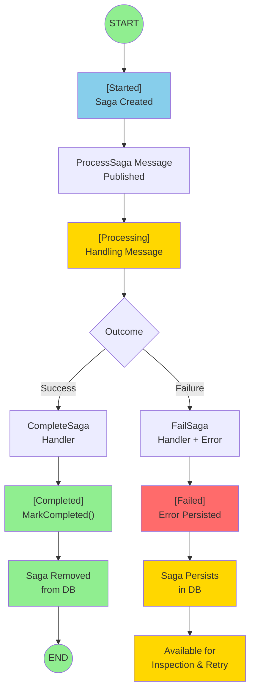
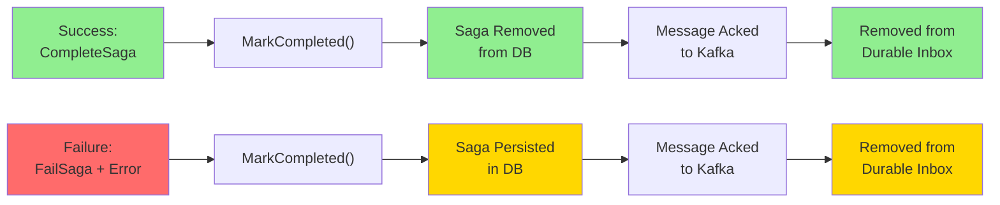

# Wolverine Sagas - Kafka State Machine Implementation

A comprehensive example of implementing a **state machine-backed saga pattern** for Kafka message processing using Wolverine, EF Core, and PostgreSQL.

## Overview

This project demonstrates how to build a sophisticated distributed saga pattern with Wolverine that provides:
- **Immediate message processing** (no artificial delays)
- **Database-backed state tracking** (Started → Processing → Completed/Failed)
- **Error message persistence** for troubleshooting
- **Durable inbox pattern** for failed message handling
- **Automatic schema management** via Weasel

The implementation is **functionally equivalent to a MassTransit StateMachine** but with a simpler, more implicit style that leverages Wolverine's message handler pattern.

## Architecture

### Saga State Machine

The saga progresses through explicit states, all persisted in PostgreSQL:



### Key Components

**1. KafkaSaga** - The saga orchestrator
- Tracks state (Started, Processing, Completed, Failed)
- Stores error messages for failed operations
- Maintains version for optimistic concurrency
- Handles messages and transitions between states

**2. KafkaHandler** - The entry point
- Receives Kafka messages
- Creates saga instances
- Triggers initial `ProcessSaga` message (no timeout delay!)

**3. KafkaSagaDbContext** - EF Core persistence
- Stores saga state in `kafka_sagas` table
- Weasel auto-manages schema updates
- Provides optimistic concurrency control

**4. Wolverine Configuration**
- Kafka transport for incoming messages
- PostgreSQL for message/saga persistence
- EF Core transactions for consistency
- Durable inbox for reliability

## Key Features

### ✅ Immediate Processing
Unlike the original implementation with 15-second timeout, messages are processed **immediately**:
```csharp
// Before: TimeoutMessage(15.Seconds()) - artificial delay
// After: ProcessSaga published directly - instant execution
public record ProcessSaga(string Id); // No timeout!
```

### ✅ State Machine Pattern
Explicit state tracking with persistence:
```csharp
public enum KafkaSagaState
{
    Started = 0,
    Processing = 1,
    Completed = 2,
    Failed = 3
}
```

### ✅ Error Tracking & Persistence
Failed sagas persist in the database with complete error details:
```csharp
public enum KafkaSagaState { Started, Processing, Completed, Failed }
public string? Message { get; set; } // Stores error details and stack trace
```
This allows you to:
- **Inspect** failed sagas and understand what went wrong
- **Debug** issues by examining error messages
- **Implement retry logic** for failed messages
- **Maintain an audit trail** of all saga executions

### ✅ Durable Processing
- Messages in durable inbox until saga completes
- Automatic cleanup on **success only**
- Failed messages persist for inspection and troubleshooting
- No message loss

### ✅ Message Lifecycle

**Success Path:**
- CompleteSaga handler executes
- Saga marked as Completed
- Saga removed from database
- Message acknowledged to Kafka

**Failure Path:**
- FailSaga handler executes with error message
- Saga marked as Failed (persisted with error details)
- Saga remains in database for troubleshooting
- Message acknowledged to Kafka (removed from inbox)



## Comparison: Wolverine vs MassTransit

| Aspect | MassTransit StateMachine | Wolverine Saga |
|--------|---|---|
| **State Declaration** | Explicit state machine definition | Enum + property |
| **Transitions** | `.TransitionTo(State)` | `State = KafkaSagaState.X` |
| **Message Handling** | `When(Event)` conditions | `Handle(Message)` methods |
| **Implicit vs Explicit** | Declarative/explicit | Handler-based/implicit |
| **Processing Model** | Deferred by default | Immediate (no timeout) |
| **Database Support** | Multiple options | EF Core, PostgreSQL, etc. |
| **Complexity** | Higher upfront ceremony | Lower, handler-focused |
| **Capability** | Equivalent | **Equivalent** ✅ |

**Bottom line:** Both are equally capable state machines. Wolverine's approach is more implicit but equally powerful.

## Tech Stack

- **.NET 10** - Latest framework
- **Wolverine 5.17.0** - Distributed messaging & sagas
- **WolverineFx.Kafka** - Kafka integration
- **Entity Framework Core 10** - ORM for persistence
- **PostgreSQL** - Primary database
- **.NET Aspire** - Application orchestration
- **Weasel** - Schema management (automatic updates)

## Project Structure

```
WolverineSagas/
├── WolverineSagas.ApiService/
│   ├── KafkaMessage.cs           # Input model from Kafka
│   ├── KafkaSaga.cs              # State machine implementation
│   ├── KafkaHandler.cs           # Message handler
│   ├── KafkaSagaDbContext.cs     # EF Core configuration
│   ├── Program.cs                # DI & Wolverine setup
│   ├── appsettings.json          # Configuration
│   ├── Migrations/               # EF Core migrations
│   └── WolverineSagas.ApiService.csproj
├── WolverineSagas.AppHost/       # Aspire orchestration (apphost.cs)
├── WolverineSagas.ServiceDefaults/
└── producer.cs                   # Interactive Kafka message producer
```

### producer.cs - Interactive Kafka Message Generator

A **standalone executable** for testing the saga with various message patterns. Built with **Spectre.Console** for rich terminal UI.

**Run the producer:**
```bash
dotnet run producer.cs
```

**Features:**
- 🎯 **Single Success Message** - Sends one message that will complete successfully
- ⚠️ **Single Failure Message** - Sends a message that triggers saga failure
- 📤 **Batch Sender** - Sends 10 random messages with progress tracking
- 🔄 **Continuous Stream** - Generates messages indefinitely (press Q to stop), with live table display
- 🎨 **Rich UI** - Color-coded panels, progress bars, formatted tables with Spectre.Console

**Configuration:**
```bash
# Override Kafka connection (default: localhost:9092)
export KAFKA_CONNECTION_STRING=kafka-host:9092
dotnet run producer.cs
```

The producer requires `PublishAot=false` in `producer.cs` to support .NET 10's restricted reflection mode.

## Getting Started

### Prerequisites
- **.NET 10 SDK** ([download](https://dotnet.microsoft.com/download))
- **PostgreSQL 17+** (or use Aspire to run containerized)
- **Kafka** (or use Aspire)
- **GitHub CLI** (for repository setup)

### Setup

1. **Clone the repository**
```bash
git clone https://github.com/benomine/WolverineSagas.git
cd WolverineSagas
```

2. **Configure PostgreSQL connection**
Edit `WolverineSagas/WolverineSagas.ApiService/appsettings.json`:
```json
{
  "ConnectionStrings": {
    "wolverine": "Host=localhost;Database=wolverine_sagas;Username=postgres;Password=postgres"
  }
}
```

3. **Build the solution**
```bash
cd WolverineSagas
dotnet build
```

### Running the Application

#### Option A: Using Aspire (Recommended)
```bash
cd WolverineSagas
aspire run
```
This automatically starts:
- PostgreSQL container
- Kafka container
- API service with automatic saga persistence

#### Option B: Local PostgreSQL + Kafka
```bash
cd WolverineSagas/WolverineSagas.ApiService
dotnet run
```

The application will:
1. ✅ Automatically apply pending migrations (via execution strategy)
2. ✅ Create `kafka_sagas` table with proper schema
3. ✅ Listen to Kafka topic `wolverine-sagas`
4. ✅ Process messages immediately
5. ✅ Persist saga state to PostgreSQL

## Testing the Saga

### Send a Successful Message
```bash
# Publish to Kafka
kafka-console-producer --broker-list localhost:9092 --topic wolverine-sagas
{"id":"550e8400-e29b-41d4-a716-446655440000","content":"Process this"}
```

**Expected behavior:**
1. Message received → Saga state: `Started`
2. ProcessSaga triggered immediately
3. Processing succeeds → Saga state: `Processing` then `Completed`
4. Saga cleaned up from database

### Send a Failed Message
```bash
kafka-console-producer --broker-list localhost:9092 --topic wolverine-sagas
{"id":"550e8400-e29b-41d4-a716-446655440001","content":"this will fail"}
```

**Expected behavior:**
1. Message received → Saga state: `Started`
2. ProcessSaga triggered immediately
3. Processing fails → Saga state: `Processing` then `Failed`
4. Error message stored in `Message` column
5. Saga cleaned up after MarkCompleted()

### Query Saga Status (before cleanup)
```sql
SELECT id, state, message, version FROM kafka_sagas;
-- Results:
-- id               | state | message                    | version
-- 550e8400-e29b... |   1   | NULL                       |   0
-- (saga persisted during processing)
```

States: 0=Started, 1=Processing, 2=Completed, 3=Failed

## How It Works

### 1. Message Arrives from Kafka
```csharp
[WolverineHandler]
public void Handle(KafkaMessage message, IMessageBus bus)
{
    var saga = new StartSaga(message);
    bus.InvokeAsync(saga);  // Create saga instance
}
```

### 2. Saga Created with Initial State
```csharp
public static (KafkaSaga, ProcessSaga) Start(StartSaga saga, ...)
{
    return (new KafkaSaga { 
        State = KafkaSagaState.Started,
        Message = null,
        Version = 0 
    }, new ProcessSaga(...));  // Immediate message (no timeout!)
}
```

### 3. ProcessSaga Handled Immediately
```csharp
public void Handle(ProcessSaga saga, IMessageBus bus)
{
    State = KafkaSagaState.Processing;
    
    try {
        // Process the message
        if (Content.Contains("fail")) throw new Exception("...");
        bus.PublishAsync(new CompleteSaga(...));
    } catch (Exception ex) {
        Message = ex.Message;  // Store error
        bus.PublishAsync(new FailSaga(..., ex.Message));
    }
}
```

### 4. State Persisted to PostgreSQL
EF Core saves saga state after each handler. Weasel automatically manages schema.

### 5. Saga Cleanup
```csharp
public void Handle(CompleteSaga saga, ...)
{
    State = KafkaSagaState.Completed;
    MarkCompleted();  // Tells Wolverine to remove saga
}
```

## Configuration Details

### Database Migration Strategy
Startup uses execution strategy to avoid transaction conflicts:
```csharp
var strategy = dbContext.Database.CreateExecutionStrategy();
await strategy.ExecuteAsync(async () => 
{
    await dbContext.Database.MigrateAsync();
});
```

### DbContext Configuration
Disables automatic retry strategy that conflicts with Wolverine transactions:
```csharp
builder.Services.AddDbContext<KafkaSagaDbContext>((sp, options) =>
{
    var datasource = sp.GetRequiredService<NpgsqlDataSource>();
    options.UseNpgsql(datasource, o => o.EnableRetryOnFailure(maxRetryCount: 0));
});
```

### Wolverine Options
```csharp
builder.Host.UseWolverine(options =>
{
    options.UseKafka(connectionString);
    options.PersistMessagesWithPostgresql(connectionString);
    options.UseEntityFrameworkCoreTransactions();
    options
        .ListenToKafkaTopic("wolverine-sagas")
        .ConfigureConsumer(c => c.GroupId = "wolverine-sagas-group")
        .ReceiveRawJson<KafkaMessage>()
        .UseDurableInbox();  // Reliable message storage
});
```

## Database Schema

**kafka_sagas table:**
```sql
CREATE TABLE kafka_sagas (
    id TEXT PRIMARY KEY,
    content TEXT,
    version INTEGER NOT NULL,
    state INTEGER NOT NULL,          -- 0=Started, 1=Processing, 2=Completed, 3=Failed
    message TEXT                     -- Error message if failed
);
```

## Troubleshooting

### "NpgsqlRetryingExecutionStrategy does not support user-initiated transactions"
**Fix:** Disable retry strategy in DbContext options (already done in this project)

### Migrations not applying at startup
**Fix:** Verify PostgreSQL is running and connection string is correct. Check logs for more details.

### Messages not being processed
1. Verify Kafka is running
2. Check topic name is `wolverine-sagas`
3. Verify consumer group `wolverine-sagas-group` exists
4. Check application logs

### Database cleanup not working
Ensure `MarkCompleted()` is called in both success and failure handlers. The saga is automatically removed once marked complete.

## Future Enhancements

- [ ] Add retry policy with exponential backoff
- [ ] Implement saga compensation/rollback
- [ ] Add metrics/telemetry dashboard
- [ ] Support for saga timeouts
- [ ] Dead-letter queue for permanently failed messages
- [ ] Saga event sourcing

## References

- **Wolverine Docs:** https://wolverine.netlify.app
- **MassTransit State Machines:** https://masstransit.io/documentation/patterns/saga
- **Distributed Saga Pattern:** https://microservices.io/patterns/data/saga.html
- **.NET Aspire:** https://learn.microsoft.com/en-us/dotnet/aspire

## License

MIT License - See LICENSE file

## Contributing

Contributions welcome! Please feel free to submit a Pull Request.

---

**Built with ❤️ using Wolverine, EF Core, and PostgreSQL**
